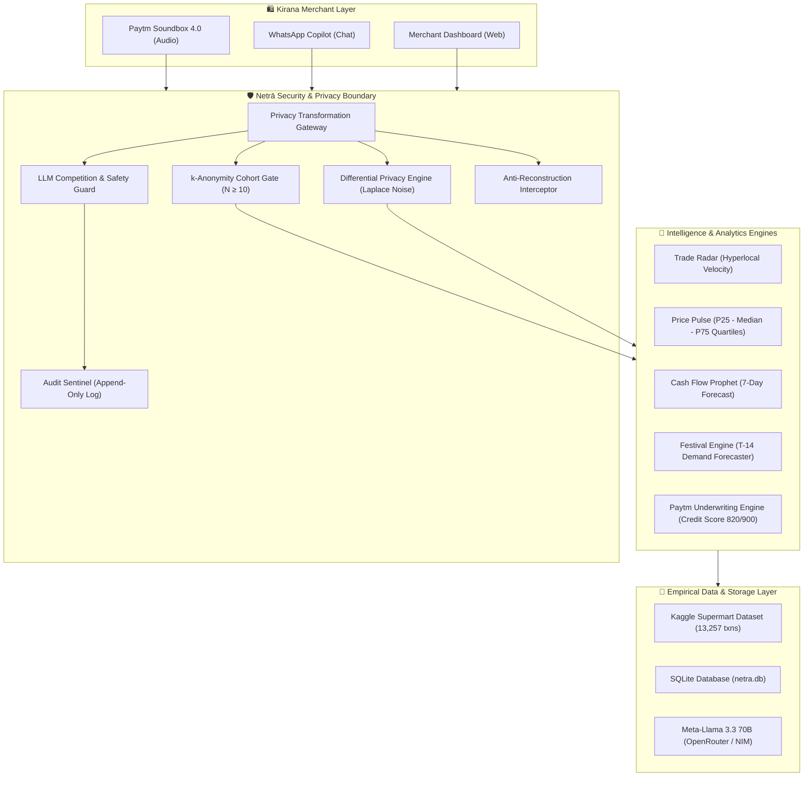

# 👁️ NETRĀ ("नेत्र") — AI Growth Copilot for Indian Kirana Merchants

> ### 🛡️ **Primary Architectural Invariant:**
> *"Network intelligence without merchant exposure."*

---

## 🌟 Executive Summary

Indian Kirana stores power **90%+ of retail food and grocery commerce** in India (~$600B+ annual GMV), yet operate completely blind to hyperlocal demand shifts. However, naive AI assistants that report:
> *"The shop 200m from you sells cold drinks for ₹35, so you should charge ₹34"*

create catastrophic real-world hazards: **predatory competitor snooping**, **margin-destroying price wars**, and **anti-competitive collusion**.

**NETRĀ ("नेत्र")** turns every **Paytm Soundbox 4.0** and WhatsApp interface into an autonomous, privacy-preserving AI Copilot. By aggregating real transaction flows into **differential privacy cohorts ($N \ge 10$)**, Netrā provides macro market intelligence (demand surges, category quartiles, 7-day cash flow forecasting, and pre-festival inventory tenders) while **mathematically guaranteeing zero competitor data leakage**.

---

## ⚡ 1-Minute Judge Quickstart

Launch the entire ecosystem with a single command:

```bash
# Clone the repository and run the demo launcher
git clone https://github.com/your-team/netra.git
cd netra
./scripts/run_demo.sh
```

- **🖥️ Web Application**: [http://localhost:3000](http://localhost:3000)
- **📖 Interactive OpenAPI Docs**: [http://localhost:8000/docs](http://localhost:8000/docs)
- **🧪 Run Full Automated Test Suite (19 Tests)**:
  ```bash
  PYTHONPATH=. ./backend/venv/bin/pytest backend/tests/ -v
  ```

---

## 🏗️ System Architecture



---

## 🛡️ The 4-Merchant Dilemma & Privacy Proofs

If four stores operate within 1 km, publishing an average allows a merchant to mathematically subtract their own sales and reverse-engineer a competitor's numbers:
$$\text{Competitor Revenue} = 4 \times \text{Average} - (\text{Store}_1 + \text{Store}_2 + \text{Store}_3)$$

Netrā eliminates this threat via a 5-tier defense architecture:

1. **Small-Cohort Suppression ($N < 10$)**:
   - Minimum threshold of 10 merchants per cluster.
   - If sub-threshold, Netrā attempts adaptive radius expansion ($1\text{km} \to 3\text{km} \to 5\text{km}$). If still $N < 10$, the insight is **strictly suppressed**.
2. **Zero Competitor PII**:
   - No code path exists that exposes competitor names, addresses, or individual ticket prices.
3. **Statistical Quartiles (Price Pulse)**:
   - Emits $P_{25}$, Median, and $P_{75}$ interquartile ranges and recommends **combo bundling** (e.g. *Tea-Time Snack Bundle for ₹45*) rather than margin-destroying discounts.
4. **Anti-Reconstruction Sliding-Window Defense**:
   - 15 queries per 24-hour window per merchant.
   - Intercepts consecutive queries with sub-kilometer diffs ($1.0\text{km}$ vs $1.1\text{km}$) to prevent differencing attacks.
5. **LLM Safety Gate & Adversarial Interception**:
   - Pre-prompt sanitization and regex/AST pattern matching intercept price-fixing coordination and competitor probes before hitting the model.

---

## 🚀 Key Modules & Capabilities

| Module | Purpose | Live Demonstration |
| :--- | :--- | :--- |
| **📈 Trade Radar** | Hyperlocal category demand momentum | Afternoon cold beverage surges (+18% in South Delhi cluster). |
| **🏷️ Price Pulse** | Non-collusive price benchmarking | Quartiles ($P_{25} = ₹54.15$, $\text{Med} = ₹91.84$, $P_{75} = ₹140.00$) with bundling advice. |
| **💰 Cash Flow Prophet** | 7-day working capital forecast | Predicts weekend liquidity peaks to smooth distributor settlement schedules. |
| **🪔 Festival Engine** | T-14 inventory stocking alerts | Fasting item demand surges (+35%) with 1-tap distributor Purchase Orders. |
| **🤖 Live WhatsApp Copilot** | Conversational merchant assistant | Free-form natural language chat in 7 Indic languages with live competitor probe blocking. |
| **📄 Paytm Credit & P&L** | Bank-ready underwriting statement | Soundbox cashflow underwritten to **820 / 900** Prime Credit Score & ₹1,50,000 overdraft. |
| **🗺️ Cluster Map Visualizer** | Interactive privacy demonstrator | Visual resolution of the 4-Merchant Dilemma ($1\text{km} \to 3\text{km} \to 5\text{km}$). |
| **🛡️ Security Sentinel** | Real-time audit log stream | Append-only tamper-evident stream with auto-refresh, search, and category filters. |
| **🦹 Attack Simulator** | Live judge verification suite | Interactive suite allowing judges to launch adversarial attacks and witness immediate blocks. |

---

## 📊 Empirical Data (Kaggle Dataset Ingestion)

Netrā is powered by the **[Supermart Grocery Sales — Retail Analytics Dataset](https://www.kaggle.com/datasets/mohamedharris/supermart-grocery-sales-retail-analytics-dataset)** (by Mohamed Harris):
- **Raw Records**: 9,995 retail transactions across authentic Indian retail categories.
- **Normalized Categories**: `beverages`, `snacks`, `staples`, `dairy`.
- **Database Scale**: **13,257 transactions** across **203 merchants** in 6 Delhi NCR clusters.
- **Realistic Soundbox UPI Scale**: Transactions mapped to authentic Kirana ticket sizes (₹15 – ₹180).

---

## 🌐 7 Indic Languages Supported

Netrā features full end-to-end internationalization across:
- 🇮🇳 **हिंदी (Hindi)**
- 🇬🇧 **English**
- 🇮🇳 **தமிழ் (Tamil)**
- 🇮🇳 **తెలుగు (Telugu)**
- 🇮🇳 **ಕನ್ನಡ (Kannada)**
- 🇮🇳 **मराठी (Marathi)**
- 🇮🇳 **বাংলা (Bengali)**

---

## 📁 Repository Structure

```text
Netra/
├── backend/
│   ├── app/
│   │   ├── analytics/       # Trade Radar, Price Pulse, Cashflow, Festival, Growth
│   │   ├── api/v1/          # REST endpoints (auth, merchant, insights, recommendations, security)
│   │   ├── auth/            # JWT tokens, password hashing, role dependencies
│   │   ├── core/            # App configuration & SQLite async database
│   │   ├── integrations/    # Sarvam AI, Cognee memory, n8n, Paytm Soundbox
│   │   ├── models/          # SQLAlchemy async models (merchants, transactions, audit)
│   │   ├── privacy/         # Small-cohort suppression, differential privacy, reconstruction guard
│   │   ├── recommendations/ # Recommendation service & LLM safety gate
│   │   ├── scripts/         # Kaggle dataset ingestion & seeding pipeline
│   │   └── security/        # Append-only audit logger
│   ├── tests/               # 19 automated pytest tests (100% passing)
│   └── requirements.txt
├── frontend/
│   ├── src/
│   │   ├── components/      # Cards, Modals (Soundbox, WhatsApp, ClusterMap, CreditStatement)
│   │   ├── i18n/            # Translations for 7 Indic languages
│   │   ├── pages/           # Dashboard, PrivacyCenter, SecuritySentinel, AttackSimulator
│   │   └── services/        # API service client
│   ├── tailwind.config.js   # Wine (#722F37) & Creme (#FFF8F0) design system
│   └── vite.config.js
├── n8n/                     # Production n8n workflows (EOD soundbox, festival tender, privacy sentinel)
├── scripts/
│   ├── run_demo.sh          # 1-click executable demo launcher
│   └── run_dev.sh           # Local development launcher
├── SECURITY.md              # Security invariant guarantees & threat defense
└── README.md
```

---

## 🧪 Verification & Automated Tests

Run the complete test suite:
```bash
PYTHONPATH=. ./backend/venv/bin/pytest backend/tests/ -v
```

All 19 tests verify:
- ✅ Small-cohort suppression ($N < 10$)
- ✅ Competitor probe blocking
- ✅ Price-fixing and coordination prompt injection defense
- ✅ Anti-reconstruction sliding-window differential attack rejection
- ✅ 7-day cash flow forecasting & festival stocking engine
- ✅ Paytm Merchant Underwriting & Credit Statement generation
- ✅ Live conversational AI Copilot with privacy guards
- ✅ JWT token authentication and role-based access control

---

## 📜 License

Built for the **Paytm Hackathon 2026** (Track 1: Merchant Growth AI).  
Licensed under the Apache 2.0 License.

